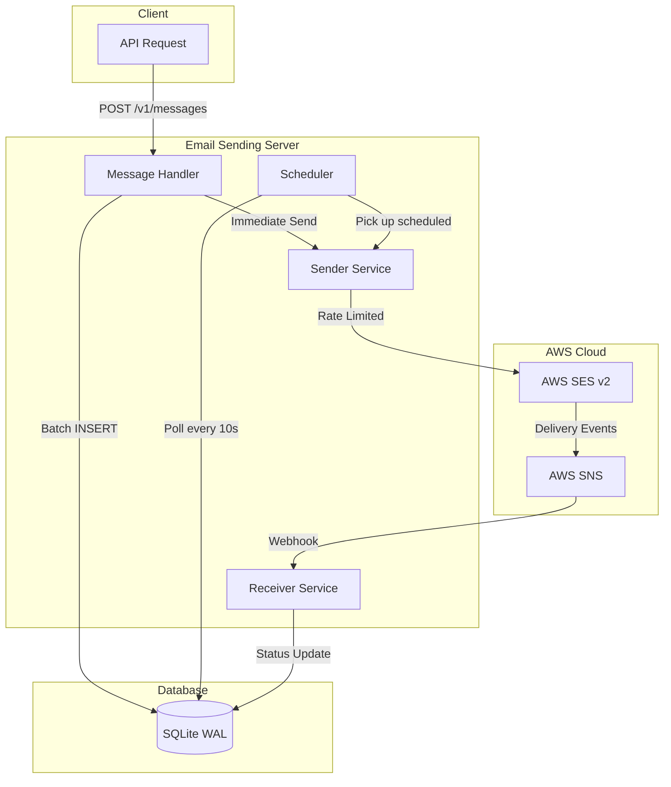
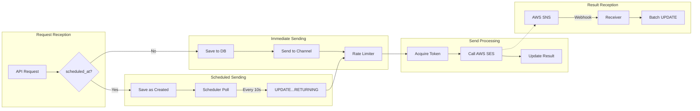
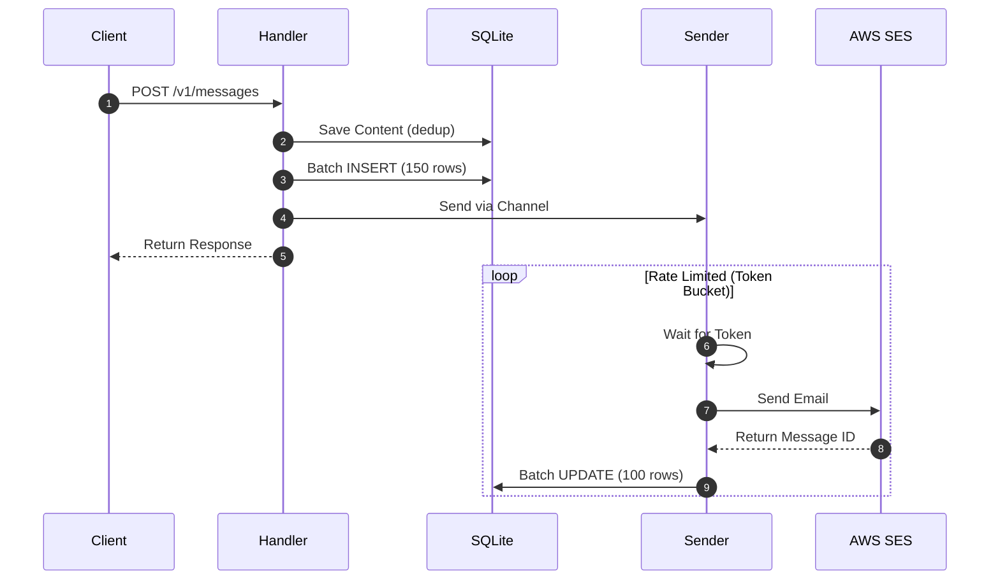
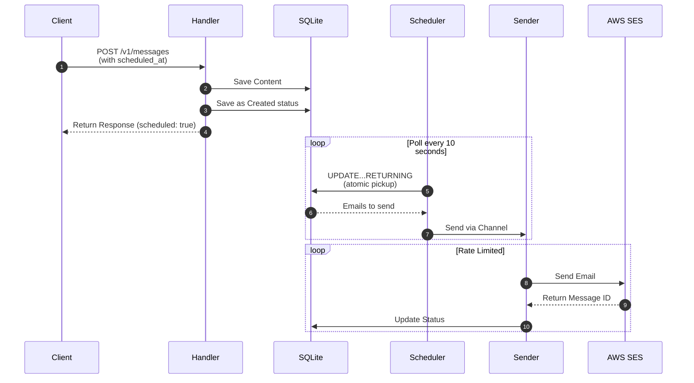
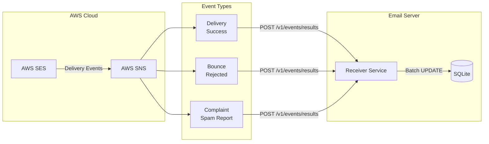
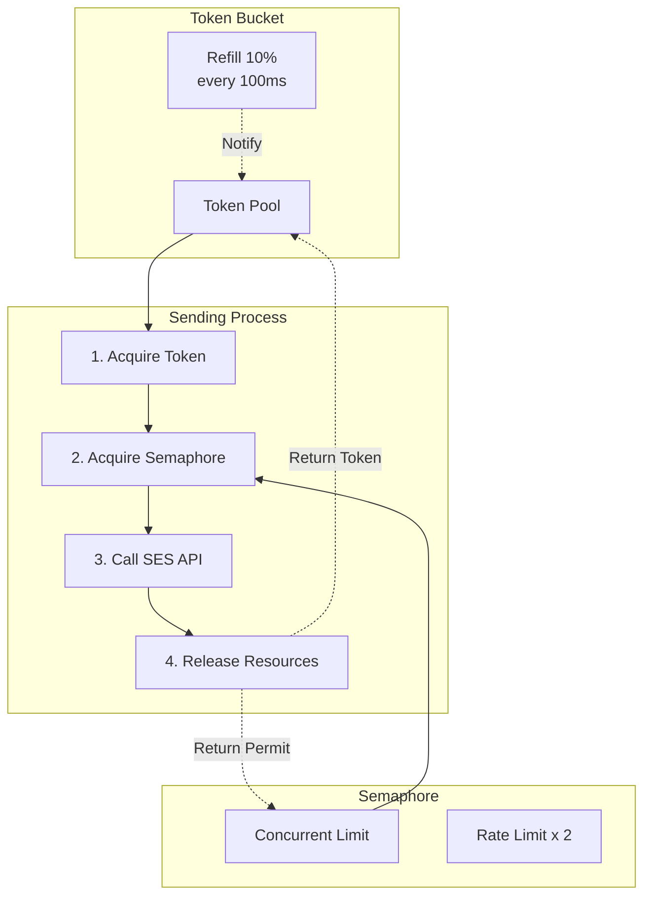
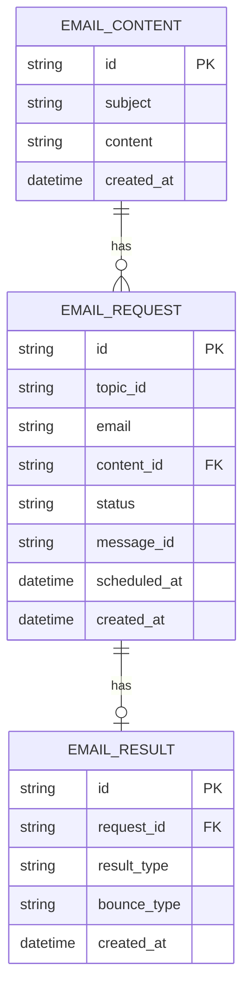

# AWS SES Email Sender

[한국어](README.md) | [English](README.en.md)

A high-performance bulk email sending and monitoring server powered by AWS SES and SNS.
Built with Rust and Tokio for exceptional throughput and reliability.

## Key Features

| Feature | Description |
|---------|-------------|
| Bulk Sending | Up to 10,000 emails per request |
| Scheduled Sending | Specify with `scheduled_at` parameter |
| Real-time Monitoring | Receive delivery results via AWS SNS |
| Open Tracking | Track opens with 1x1 transparent pixel |
| Cancel Sending | Cancel pending emails by topic |
| Topic Statistics | View delivery status by topic |

## Tech Stack

| Component | Technology |
|-----------|------------|
| Backend | Rust + Axum |
| Email Service | AWS SES v2 |
| Notification | AWS SNS |
| Async Runtime | Tokio |
| Database | SQLite (WAL mode) |
| Auth | X-API-KEY Header |
| Monitoring | Sentry + tracing |

---

## System Architecture

### Overall System Flow



### Email Sending Process



### Immediate Sending Sequence

When a client requests without `scheduled_at`, emails are sent immediately.



### Scheduled Sending Sequence

Requests with `scheduled_at` wait until the specified time before sending.



### SNS Event Processing

Receive delivery results from AWS SES via SNS.



### Rate Limiting Architecture

Event-driven approach combining Token Bucket and Semaphore.



### Database Schema



---

## Performance Optimizations

### Rate Limiting

| Component | Method | Feature |
|-----------|--------|---------|
| Token Bucket | `Notify` based | Event-driven, no polling |
| Semaphore | Concurrent limit | 2x Rate Limit |
| Refill | 10% every 100ms | Even distribution |

### Database

| Optimization | Effect |
|--------------|--------|
| WAL Mode | Concurrent reads during writes |
| mmap 256MB | Memory-mapped I/O |
| Cache 64MB | In-memory cache |
| Batch INSERT | 10x+ performance improvement |
| CASE WHEN UPDATE | Bulk updates |
| UPDATE...RETURNING | Atomic scheduler pickup |
| Composite Indexes | Query optimization |

### Memory Optimization

| Technique | Effect |
|-----------|--------|
| `Arc<String>` | Share subject/content (1 allocation for 10,000 emails) |
| `Vec::with_capacity()` | Prevent reallocations |
| Lazy Copy | Add tracking pixel at send time |

### Connection Management

| Resource | Setting |
|----------|---------|
| SES Client | OnceCell singleton |
| DB Pool | 5-20 connections |
| Send Channel | 10,000 buffer |
| Post-process Channel | 1,000 buffer |

---

## Setup Guide

### AWS SES Configuration

1. **Sandbox Removal** (Production)
   - [Request via AWS Support Center](https://docs.aws.amazon.com/ses/latest/dg/request-production-access.html)

2. **Domain Authentication**
   - Register domain in AWS SES console
   - Add DKIM and SPF records to DNS

3. **Email Verification** (Sandbox)
   - Register sender email address

### AWS SNS Configuration (Optional)

1. Create SNS topic
2. Add SES event destination (Bounce, Complaint, Delivery)
3. Set up HTTP subscription (`/v1/events/results`)

---

## Environment Variables

| Variable | Required | Default | Description |
|----------|:--------:|---------|-------------|
| `SERVER_PORT` | | 8080 | Server port |
| `SERVER_URL` | O | | External access URL |
| `API_KEY` | O | | API authentication key |
| `AWS_REGION` | | ap-northeast-2 | AWS region |
| `AWS_ACCESS_KEY_ID` | O | | AWS access key |
| `AWS_SECRET_ACCESS_KEY` | O | | AWS secret key |
| `AWS_SES_FROM_EMAIL` | O | | Verified sender email |
| `MAX_SEND_PER_SECOND` | | 24 | Maximum sends per second |
| `SENTRY_DSN` | | | Sentry DSN |
| `RUST_LOG` | | info | Log level |

---

## Quick Start

```bash
# Run server (migrations auto-applied)
cargo run --release

# Docker
docker build -t ses-sender .
docker run -p 3000:3000 --env-file .env ses-sender
```

> Database migrations are automatically applied on server startup (`migrations/` folder)

---

## API Reference

### Send Email

```http
POST /v1/messages
X-API-KEY: {api_key}
Content-Type: application/json
```

```json
{
  "messages": [
    {
      "topic_id": "newsletter_2024_01",
      "emails": ["user1@example.com", "user2@example.com"],
      "subject": "January Newsletter",
      "content": "<h1>Hello!</h1><p>...</p>"
    }
  ],
  "scheduled_at": "2024-01-01 09:00:00"
}
```

**Response:**
```json
{
  "total": 2,
  "success": 2,
  "errors": 0,
  "duration_ms": 45,
  "scheduled": true
}
```

### Event API

| Endpoint | Method | Description |
|----------|:------:|-------------|
| `/v1/events/open?request_id={id}` | GET | Open tracking (1x1 PNG) |
| `/v1/events/counts/sent?hours=24` | GET | Get sent count |
| `/v1/events/results` | POST | Receive SNS events |

### Topic API

| Endpoint | Method | Description |
|----------|:------:|-------------|
| `/v1/topics/{topic_id}` | GET | Get statistics |
| `/v1/topics/{topic_id}` | DELETE | Cancel pending emails |

### Health Check

| Endpoint | Description | Auth |
|----------|-------------|:----:|
| `/health` | Basic health check | |
| `/ready` | DB connection check | |

---

## Project Structure

```
src/
├── main.rs                 # Entry point, Graceful Shutdown
├── app.rs                  # Router configuration
├── config.rs               # Environment variables
├── constants.rs            # Constants (BATCH_INSERT_SIZE)
├── state.rs                # Application state
├── handlers/
│   ├── message_handlers.rs # Email sending API
│   ├── event_handlers.rs   # SNS events, open tracking
│   ├── health_handlers.rs  # Health checks
│   └── topic_handlers.rs   # Topic management
├── services/
│   ├── scheduler.rs        # Scheduled email pickup
│   ├── receiver.rs         # Rate-limited sending, batch updates
│   └── sender.rs           # AWS SES API calls
├── models/
│   ├── content.rs          # EmailContent
│   ├── request.rs          # EmailRequest (Arc<String>)
│   └── result.rs           # EmailResult
├── middlewares/
│   └── auth_middlewares.rs # API Key authentication
└── tests/                  # Tests
```

---

## Development

### Code Style

```bash
cargo fmt                   # Formatting
cargo clippy               # Linter
```

### Build

```bash
cargo build                # Development
cargo build --release      # Release
cargo check                # Check only
```

### Testing

```bash
cargo test                      # All tests
cargo test -- --nocapture      # With output
cargo test test_save_batch     # Specific test
```

### Monitoring

```bash
RUST_LOG=debug cargo run  # Detailed logs
RUST_LOG=info cargo run   # Normal operation
RUST_LOG=warn cargo run   # Warnings only
```

### Key Dependencies

| Crate | Purpose |
|-------|---------|
| axum | Web framework |
| tokio | Async runtime |
| sqlx | SQLite |
| aws-sdk-sesv2 | AWS SES |
| serde | Serialization |
| tracing | Logging |
| sentry | Error tracking |

---

## References

- [AWS SES Developer Guide](https://docs.aws.amazon.com/ses/latest/dg/Welcome.html)
- [AWS SNS Developer Guide](https://docs.aws.amazon.com/sns/latest/dg/welcome.html)
- [Axum Documentation](https://docs.rs/axum)
- [SQLx Documentation](https://docs.rs/sqlx)

## License

MIT License
