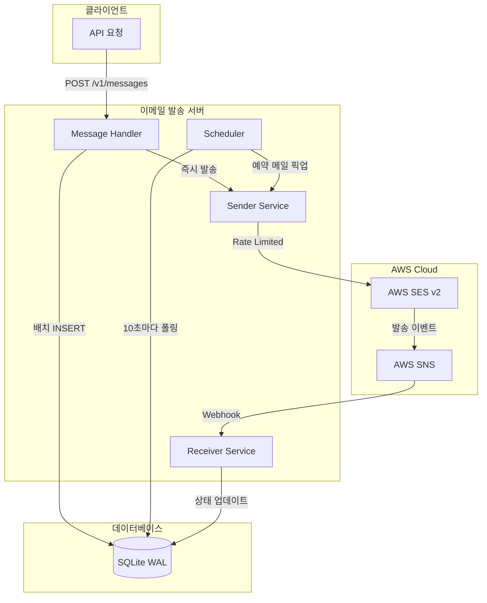
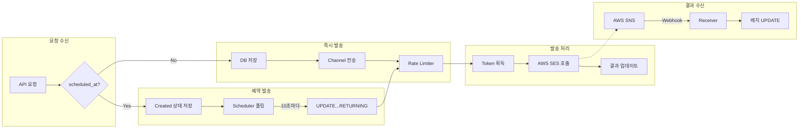
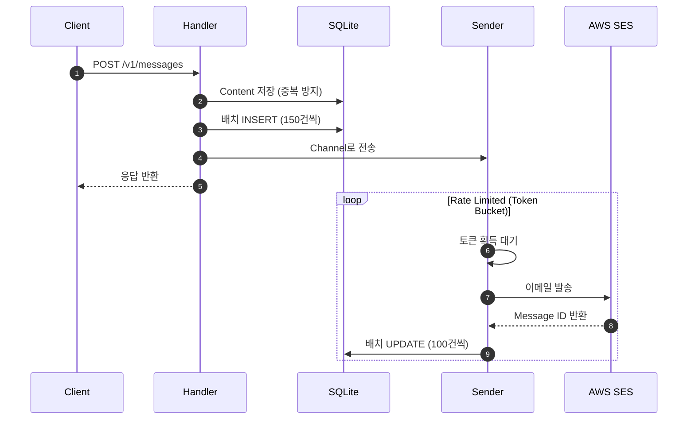
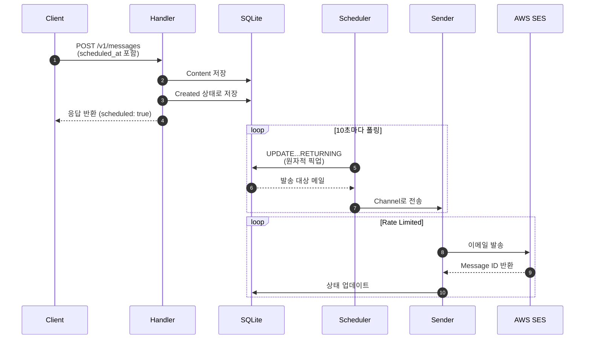
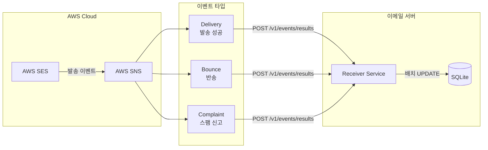
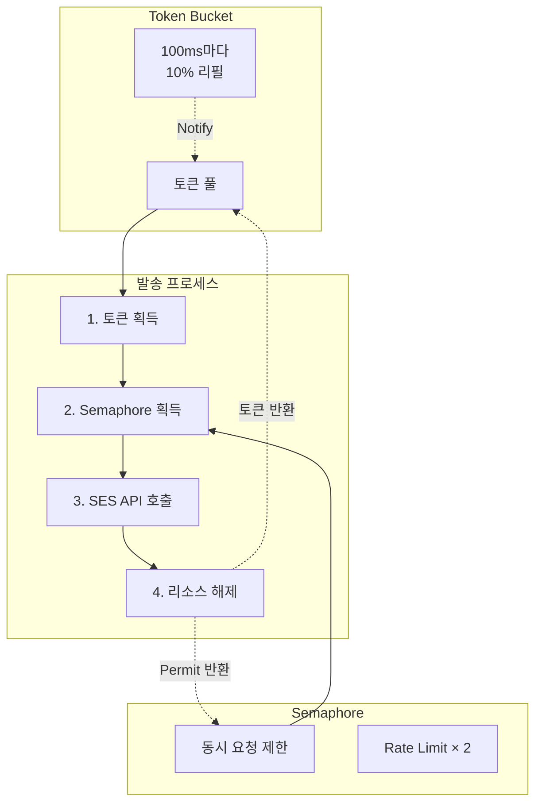
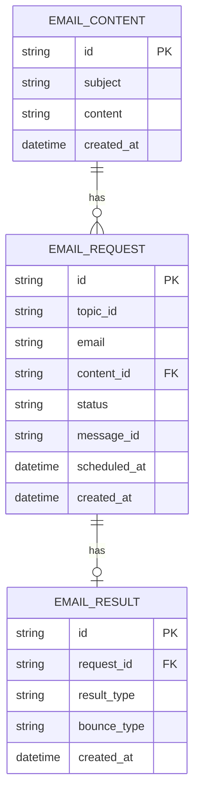

# AWS SES Email Sender

[한국어](README.md) | [English](README.en.md)

AWS SES와 SNS를 활용한 고성능 대량 이메일 발송 및 모니터링 서버입니다.
Rust와 Tokio를 기반으로 구축되어 높은 처리량과 안정성을 제공합니다.

## 주요 기능

| 기능 | 설명 |
|------|------|
| 대량 발송 | 요청당 최대 10,000건 |
| 예약 발송 | `scheduled_at` 파라미터로 지정 |
| 실시간 모니터링 | AWS SNS를 통한 발송 결과 수신 |
| 오픈 트래킹 | 1x1 투명 픽셀로 열람 추적 |
| 발송 취소 | 토픽별 대기 중인 이메일 취소 |
| 토픽 통계 | 상태별 발송 현황 조회 |

## 기술 스택

| 구성 요소 | 기술 |
|----------|------|
| Backend | Rust + Axum |
| Email Service | AWS SES v2 |
| Notification | AWS SNS |
| Async Runtime | Tokio |
| Database | SQLite (WAL mode) |
| 인증 | X-API-KEY 헤더 |
| 모니터링 | Sentry + tracing |

---

## 시스템 아키텍처

### 전체 시스템 흐름



### 이메일 발송 프로세스



### 즉시 발송 시퀀스

클라이언트가 `scheduled_at` 없이 요청하면 즉시 발송됩니다.



### 예약 발송 시퀀스

`scheduled_at`이 포함된 요청은 지정 시간까지 대기 후 발송됩니다.



### SNS 이벤트 처리

AWS SES에서 발송 결과를 SNS를 통해 수신합니다.



### Rate Limiting 구조

Token Bucket과 Semaphore를 조합한 이벤트 드리븐 방식입니다.



### 데이터베이스 스키마



---

## 성능 최적화

### Rate Limiting

| 구성 요소 | 방식 | 특징 |
|----------|------|------|
| Token Bucket | `Notify` 기반 | 폴링 없는 이벤트 드리븐 |
| Semaphore | 동시 요청 제한 | Rate Limit의 2배 |
| 리필 | 100ms마다 10% | 균등 분배 |

### 데이터베이스

| 최적화 | 효과 |
|--------|------|
| WAL 모드 | 쓰기 중 동시 읽기 가능 |
| mmap 256MB | 메모리 맵 I/O |
| 캐시 64MB | 인메모리 캐시 |
| 배치 INSERT | 10배 이상 성능 향상 |
| CASE WHEN UPDATE | 벌크 업데이트 |
| UPDATE...RETURNING | 원자적 스케줄러 픽업 |
| 복합 인덱스 | 쿼리 최적화 |

### 메모리 최적화

| 기법 | 효과 |
|------|------|
| `Arc<String>` | Subject/content 공유 (10,000건 발송 시 1회 할당) |
| `Vec::with_capacity()` | 재할당 방지 |
| 지연 복사 | 트래킹 픽셀을 발송 시점에 추가 |

### 커넥션 관리

| 리소스 | 설정 |
|--------|------|
| SES 클라이언트 | OnceCell 싱글톤 |
| DB 풀 | 5-20개 연결 |
| 발송 채널 | 10,000개 버퍼 |
| 후처리 채널 | 1,000개 버퍼 |

---

## 설정 가이드

### AWS SES 설정

1. **샌드박스 해제** (프로덕션)
   - [AWS Support Center에서 요청](https://docs.aws.amazon.com/ses/latest/dg/request-production-access.html)

2. **도메인 인증**
   - AWS SES 콘솔에서 도메인 등록
   - DNS에 DKIM, SPF 레코드 추가

3. **이메일 인증** (샌드박스)
   - 발신자 이메일 등록

### AWS SNS 설정 (선택)

1. SNS 주제 생성
2. SES 이벤트 대상 추가 (Bounce, Complaint, Delivery)
3. HTTP 구독 설정 (`/v1/events/results`)

---

## 환경 변수

| 변수 | 필수 | 기본값 | 설명 |
|------|:----:|--------|------|
| `SERVER_PORT` | | 8080 | 서버 포트 |
| `SERVER_URL` | O | | 외부 접근 URL |
| `API_KEY` | O | | API 인증 키 |
| `AWS_REGION` | | ap-northeast-2 | AWS 리전 |
| `AWS_ACCESS_KEY_ID` | O | | AWS 액세스 키 |
| `AWS_SECRET_ACCESS_KEY` | O | | AWS 시크릿 키 |
| `AWS_SES_FROM_EMAIL` | O | | 발신자 이메일 |
| `MAX_SEND_PER_SECOND` | | 24 | 초당 최대 발송량 |
| `SENTRY_DSN` | | | Sentry DSN |
| `RUST_LOG` | | info | 로그 레벨 |

---

## 빠른 시작

```bash
# 데이터베이스 초기화
./init_database.sh

# 서버 실행
cargo run --release

# Docker
docker build -t ses-sender .
docker run -p 3000:3000 --env-file .env ses-sender
```

---

## API 레퍼런스

### 이메일 발송

```http
POST /v1/messages
X-API-KEY: {api_key}
Content-Type: application/json
```

```json
{
  "messages": [
    {
      "topic_id": "newsletter_2024_01",
      "emails": ["user1@example.com", "user2@example.com"],
      "subject": "1월 뉴스레터",
      "content": "<h1>안녕하세요!</h1><p>...</p>"
    }
  ],
  "scheduled_at": "2024-01-01 09:00:00"
}
```

**응답:**
```json
{
  "total": 2,
  "success": 2,
  "errors": 0,
  "duration_ms": 45,
  "scheduled": true
}
```

### 이벤트 API

| 엔드포인트 | 메서드 | 설명 |
|----------|:------:|------|
| `/v1/events/open?request_id={id}` | GET | 오픈 트래킹 (1x1 PNG) |
| `/v1/events/counts/sent?hours=24` | GET | 발송 건수 조회 |
| `/v1/events/results` | POST | SNS 이벤트 수신 |

### 토픽 API

| 엔드포인트 | 메서드 | 설명 |
|----------|:------:|------|
| `/v1/topics/{topic_id}` | GET | 통계 조회 |
| `/v1/topics/{topic_id}` | DELETE | 발송 취소 |

### 헬스 체크

| 엔드포인트 | 설명 | 인증 |
|----------|------|:----:|
| `/health` | 기본 헬스 체크 | |
| `/ready` | DB 연결 확인 | |

---

## 프로젝트 구조

```
src/
├── main.rs                 # 진입점, Graceful Shutdown
├── app.rs                  # 라우터 설정
├── config.rs               # 환경변수
├── constants.rs            # 상수 (BATCH_INSERT_SIZE)
├── state.rs                # 애플리케이션 상태
├── handlers/
│   ├── message_handlers.rs # 이메일 발송 API
│   ├── event_handlers.rs   # SNS 이벤트, 오픈 트래킹
│   ├── health_handlers.rs  # 헬스 체크
│   └── topic_handlers.rs   # 토픽 관리
├── services/
│   ├── scheduler.rs        # 예약 이메일 조회
│   ├── receiver.rs         # Rate-limited 발송, 배치 업데이트
│   └── sender.rs           # AWS SES API 호출
├── models/
│   ├── content.rs          # EmailContent
│   ├── request.rs          # EmailRequest (Arc<String>)
│   └── result.rs           # EmailResult
├── middlewares/
│   └── auth_middlewares.rs # API Key 인증
└── tests/                  # 테스트
```

---

## 개발

### 코드 스타일

```bash
cargo fmt                   # 포맷팅
cargo clippy               # 린터
```

### 빌드

```bash
cargo build                # 개발
cargo build --release      # 릴리즈
cargo check                # 검사만
```

### 테스트

```bash
cargo test                      # 전체 테스트
cargo test -- --nocapture      # 출력 포함
cargo test test_save_batch     # 특정 테스트
```

### 모니터링

```bash
RUST_LOG=debug cargo run  # 상세 로그
RUST_LOG=info cargo run   # 일반 운영
RUST_LOG=warn cargo run   # 경고만
```

### 주요 의존성

| 크레이트 | 용도 |
|---------|------|
| axum | 웹 프레임워크 |
| tokio | 비동기 런타임 |
| sqlx | SQLite |
| aws-sdk-sesv2 | AWS SES |
| serde | 직렬화 |
| tracing | 로깅 |
| sentry | 에러 트래킹 |

---

## 참고 자료

- [AWS SES 개발자 가이드](https://docs.aws.amazon.com/ses/latest/dg/Welcome.html)
- [AWS SNS 개발자 가이드](https://docs.aws.amazon.com/sns/latest/dg/welcome.html)
- [Axum 문서](https://docs.rs/axum)
- [SQLx 문서](https://docs.rs/sqlx)

## 라이선스

MIT License
